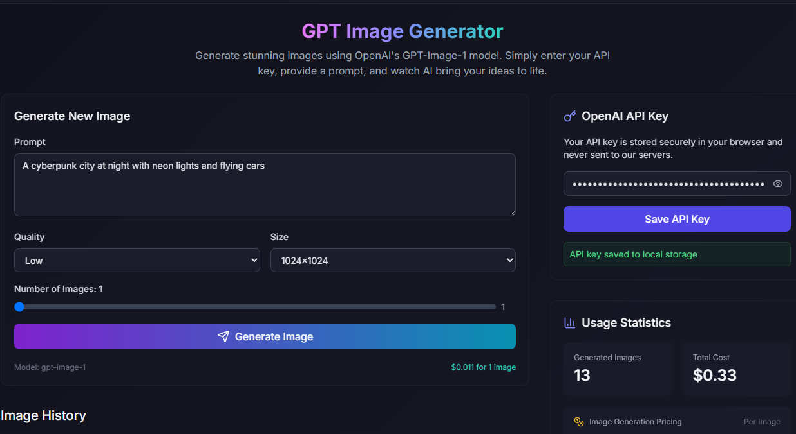

# GPT Image Generator ✨

[](https://kit.svelte.dev/)
[](https://tailwindcss.com/)
[](https://openai.com/)
[](https://www.typescriptlang.org/)

A modern web application built with SvelteKit and Tailwind CSS that allows users to generate stunning images using OpenAI's image generation models.

 <!-- Add a screenshot of your application here -->

## Features

*   **AI Image Generation**: Leverages OpenAI's powerful models to create images from text prompts.
*   **API Key Management**: Securely stores your OpenAI API key in the browser's IndexedDB.
*   **Image Gallery**: Displays previously generated images.
*   **Regenerate Option**: Easily regenerate an image with the same prompt.
*   **Usage Statistics**: Tracks usage information (details depend on implementation).
*   **Responsive Design**: Adapts beautifully to different screen sizes thanks to Tailwind CSS.
*   **Modern UI**: Clean and intuitive user interface built with Svelte.

## Tech Stack

*   **Framework**: SvelteKit
*   **Styling**: Tailwind CSS
*   **Language**: TypeScript
*   **AI**: OpenAI API
*   **Icons**: Lucide Svelte
*   **Client-side Storage**: IndexedDB (via `idb` library)
*   **Package Manager**: pnpm
*   **Build Tool**: Vite

## Getting Started

### Prerequisites

*   Node.js (v18 or higher recommended)
*   pnpm (Install using `npm install -g pnpm`)
*   An OpenAI API Key (Get one from [OpenAI Platform](https://platform.openai.com/))

### Installation & Setup

1.  **Clone the repository:**
    ```bash
    git clone https://github.com/your-username/gpt-images.git # Replace with your repo URL
    cd gpt-images
    ```

2.  **Install dependencies:**
    ```bash
    pnpm install
    ```

3.  **Environment Variables (Optional):**
    If the application requires environment variables (e.g., for a backend API key if implemented differently), create a `.env` file in the root directory based on `.env.example` (if provided).
    ```
    # Example .env file content
    OPENAI_API_KEY="your_secret_key_here" # Usually handled client-side in this setup
    ```
    *Note: In the current setup, the API key seems to be managed client-side via the UI and stored in IndexedDB. Be mindful of security implications when handling API keys.*

### Running the Development Server

```bash
pnpm run dev
```

This command starts a local development server. Open your browser and navigate to `http://localhost:5173` (or the port specified in the output).

Enter your OpenAI API key in the application's UI to start generating images.

### Building for Production

```bash
pnpm run build
```

This command creates an optimized production build of your application in the `build` directory (or as configured in `svelte.config.js`).

### Previewing the Production Build

```bash
pnpm run preview
```

This command starts a local server to preview the production build.

## Project Structure

```
gpt-images/
├── .svelte-kit/      # SvelteKit build artifacts (generated)
├── node_modules/     # Project dependencies (managed by pnpm)
├── public/           # Static assets (favicon, images, etc.)
├── src/
│   ├── app.css       # Global CSS styles
│   ├── app.html      # HTML template shell
│   ├── assets/       # Static assets imported by modules
│   ├── lib/          # Application library (components, utils, etc.)
│   │   ├── components/ # Reusable Svelte components
│   │   ├── db/         # Database interaction (IndexedDB)
│   │   ├── services/   # API interactions (OpenAI)
│   │   ├── stores/     # Svelte stores
│   │   └── utils/      # Utility functions
│   ├── routes/       # Application pages and endpoints
│   │   ├── +layout.svelte # Root layout component
│   │   └── +page.svelte   # Main page component
│   └── ...           # Other SvelteKit files (hooks, service-worker)
├── .gitignore        # Files/folders ignored by Git
├── package.json      # Project metadata and dependencies
├── pnpm-lock.yaml    # Exact dependency versions
├── pnpm-workspace.yaml # pnpm workspace configuration
├── postcss.config.js # PostCSS configuration
├── README.md         # This file
├── svelte.config.js  # SvelteKit configuration
├── tailwind.config.js# Tailwind CSS configuration
├── tsconfig.json     # TypeScript configuration
├── tsconfig.node.json# TypeScript configuration for Node.js parts
└── vite.config.ts    # Vite configuration
```

## Contributing

Contributions are welcome! Please follow standard fork-and-pull-request workflows.

## License

This project is licensed under the MIT License - see the LICENSE file for details (if applicable).

---

*Remember to add a `screenshot.png` to the `public` folder or update the path in the README.*
